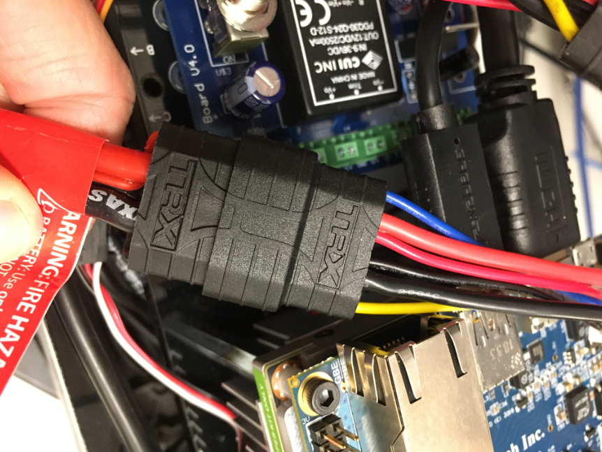
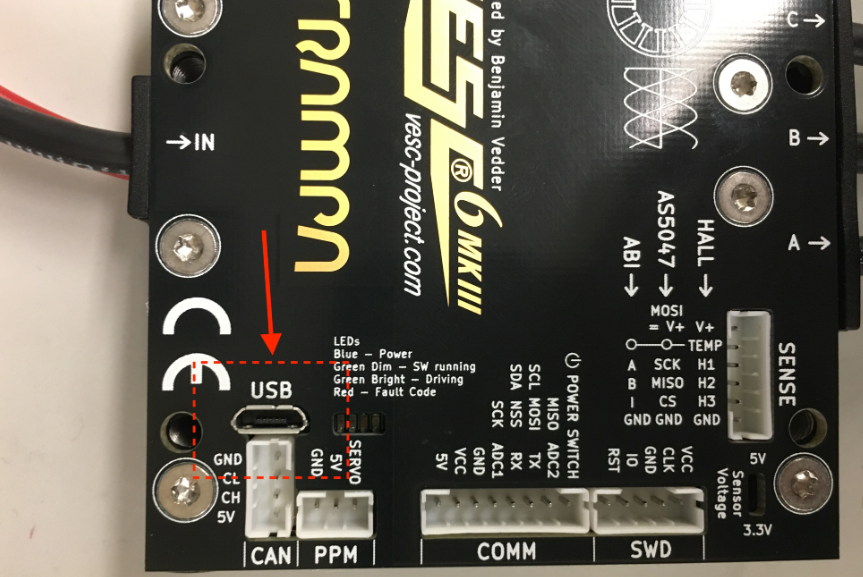
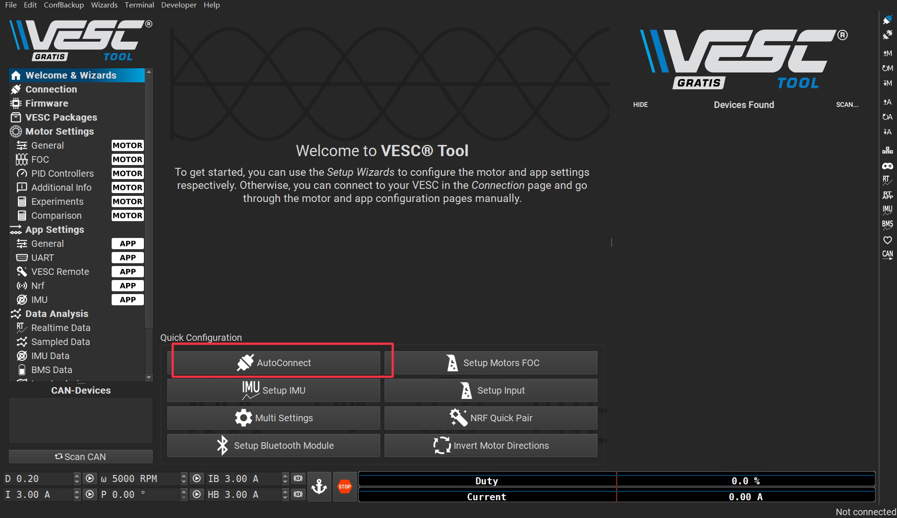
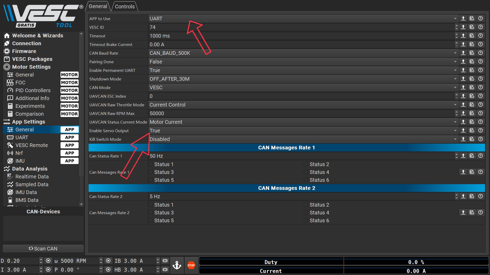
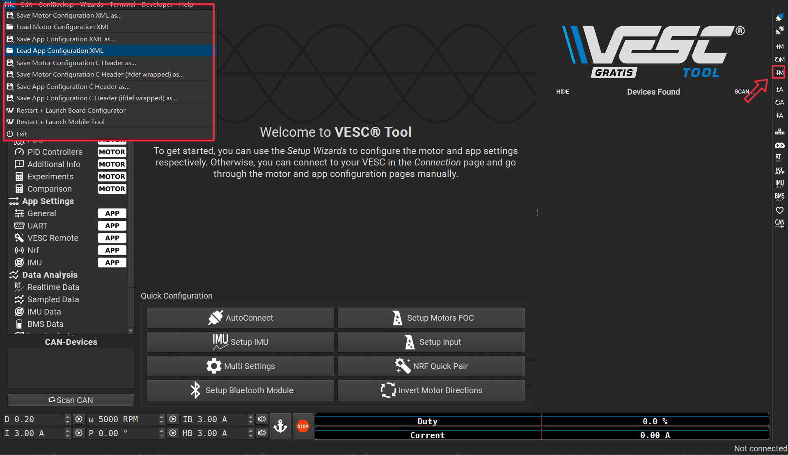
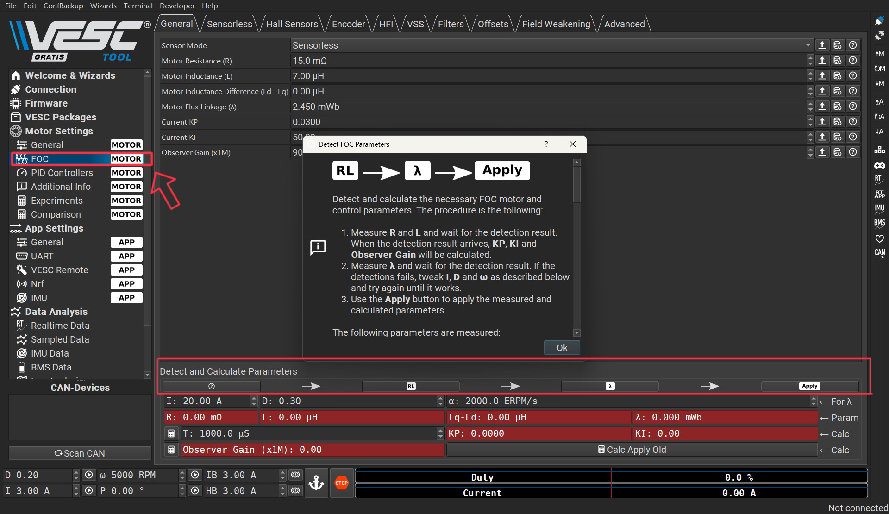
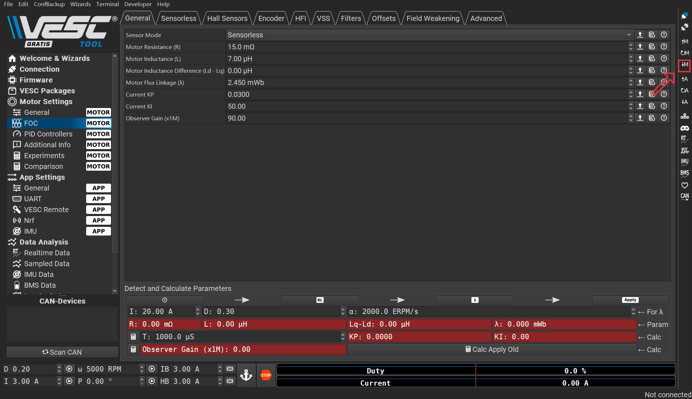
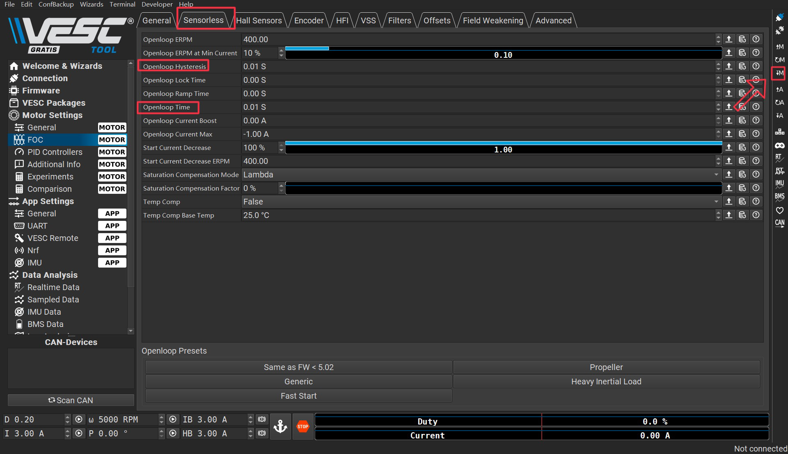
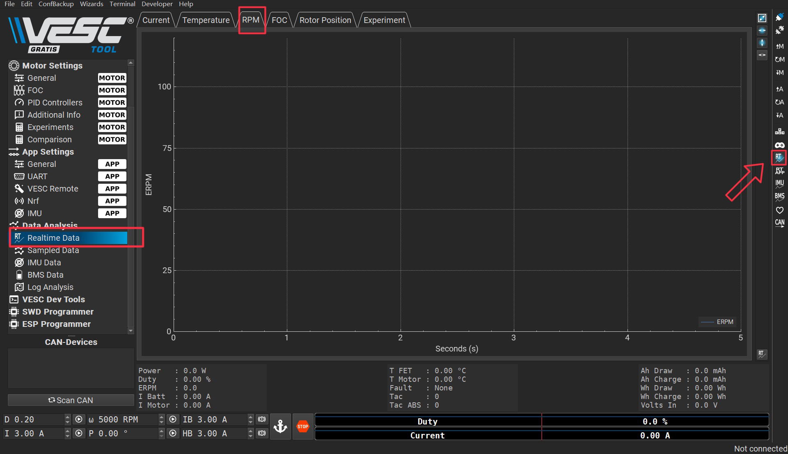
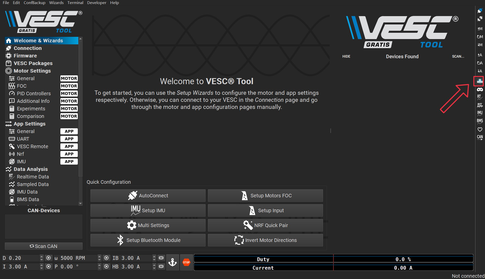

# F1-Tenth_Duke
## Configuring the VESC
 Most of our steps were followed from [F1 Tenth Official website-Install F1TENTH Driver Stack-Configuring the VESC](https://f1tenth.org/build.html#). The information shown on the official website is almost everything you will need for configuring the VESC.

 However, we still encountered some problems in the process that were not clearly explained in the official website. We will list these issues and their solutions below.

## Table of Contents
1. [What is a VESC](#WhatisaVESC)
2. [Equipment required before this step](#Equipment)
3. [Version of VESC](#version)
4. [Powering the VESC](#Power)
5. [Connecting the VESC to Your Laptop](#Connect)
6. [Updating the Firmare on the VESC](#Firmare)
7. [Uploading the Motor Configuration XML](#XML)
8. [Changing the Openloop Hysteresis and Openloop Time](#Openloop)
9. [Realtime Data and Keypad Control](#Realtime)

### What is a VESC?
 A VESC, also called "Vedder Electronic Speed Controller", is a programmable and highly versatile electronic device used to control the speed and direction of electric motors. At its core, a VESC is designed to convert electrical energy into mechanical motion, allowing for seamless control of the motor's behavior.

### Equipment required before this step
 1. Fully built F1TENTH vehicle
 2. A box or Car stand to put vehicle on (This is important to put your car on an elevated stand or box so that its wheels can turn without it going anywhere)
 3. Laptop/computer (does not need to be running Linux)

### Version of VESC
 We need to install the VESC Tool so that we could configure the VESC. The newest version of [VESC Tool](https://vesc-project.com/node/17#) is 6.02 for free. You will need to register for an account to download. The newest free version of vesc tool is 6.02, which is also the version that we recommand to use. After adding it to cart and checkout, a download link will be sent to your email address. VESC Tool could be install whatever your system is Linux, Windows and MacOS.

 
### Powering the VESC
 First we need to power the VESC. Plug the battery in, and make sure the polarity is correct. Note that you don’t need to turn on the Powerboard for configuring the VESC.

Next, unplug the USB cable of the VESC from the Jetson NX and plug the USB into your laptop that’s running the VESC Tool. You may want to use a longer cable.

### Connecting the VESC to Your Laptop
 Launch the VESC Tool. On the Welcome page, press the **AutoConnect** button on bottom left of the page. After the VESC is connected, you should see an updated status on the bottom right of the screen.

### Updating the Firmware on the VESC
 The first thing atfer connecting the VESC to your laptop is to update the Firmware on the VESC. To enable servo output in the newest version of VESC Tool so that the VESC on your vehicle could control the steering, go to **App Settings** > **General** > **Enable Servo Output** > **True**. Do not change the **App Settings** > **General** > **App to use** to **PPM**, which would cause servo unable to output.

 
### Uploading the Motor Configuration XML
 After firmware update, Select **Load Motor Configuration XML** from the drop down menu and select the provided XML file from [here](https://drive.google.com/file/d/1-KiAh3hCROPZAPeOJtXWvfxKY35lhhTO/view). After the XML is uploaded, click on the **Write Motor Configuration** button (the button with a down arrow and the letter M) on the right side of the screen to apply the motor configuration. Note that in the future, you’ll have to press this button whenever you make a change in motor configuration.

 
### Detecting and Calculating Motor Parameters
 To detect and calculate the FOC motor parameters, navigate to the **FOC** tab under **Motor Settings** on the left. At the bottom of the screen, follow the direction of the arrows and clck on the four buttons one by one, and follow the on screen prompt. Note that during the measuring process, the motor will make noise and spin, make sure the wheels of your vehicle are clear.

 After the motor parameters are measured, the fields at the bottom of the screen should turn green. Click on the **Apply** button, and click the **Write Motor Configuration** button.

### Changing the Openloop Hysteresis and Openloop Time
 Navigate to the **Sensorless** tab on top of the screen. Change the **Openloop Hysteresis** and **Openloop Time** to 0.01, and click the **Write Motor Configuration** button.

### Realtime Data and Keypad Control
 To see the RPM response from the motor, navigate to the **Realtime Data** tab under **Data Analysis** on the left. Click **Stream Realtime Data** button on the right (the button with letters RT), and navigate to the **RPM** tab on the top of the screen. You should see RPM data streaming now.

 Now you can try to speed up and test your vehicle by keyboard. Click the **Enable KeyBoard COntrol** button on the right bar.

 

